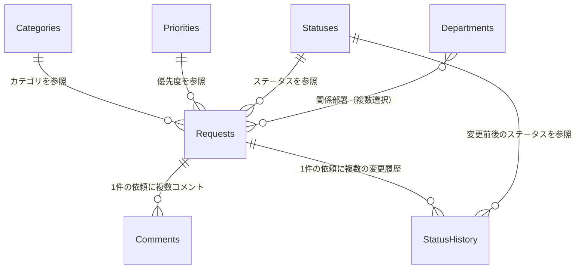

# データモデル定義（改善依頼管理アプリ）

SharePoint Listsとして作成するテーブル（リスト）とマスタの定義。`REQUIREMENTS.md`の内容から設計している。
実際にListsを作成する際は、[0章 命名方針](#0-命名方針作成手順の注意)を先に読んでから作成すること。

## 0. 命名方針・作成手順の注意

- **物理名（列の内部名）は英語のPascalCase**、**論理名（表示名）は日本語**とする。
- **SharePointの既知の注意点**: リストの列を作成する際、最初に入力した表示名から内部名（内部識別子）が自動生成される。日本語の表示名で列を作成すると、内部名がURLエンコードされた読みにくい文字列（例: `_x30bf_x30a4_x30c8_x30eb_`）になり、後から表示名を日本語に変更しても内部名は変わらない。
- **そのため、列は必ず英語の表示名でいったん作成し、保存後に表示名だけを日本語にリネームすること。** 内部名は英語のまま固定される。
- 以下の表の「物理名」列がその英語名（列作成時に最初に入力する名前）、「論理名」列が最終的な日本語の表示名。

## 1. 全体構成

作成するリスト一覧:

| リスト名（物理名） | 論理名 | 種類 |
|---|---|---|
| `Requests` | 依頼 | トランザクション |
| `Comments` | コメント | トランザクション |
| `StatusHistory` | ステータス変更履歴 | トランザクション（監査ログ） |
| `Categories` | カテゴリマスタ | マスタ |
| `Departments` | 担当部署マスタ | マスタ |
| `Priorities` | 優先度マスタ | マスタ |
| `Statuses` | ステータスマスタ | マスタ（固定9件） |
| `AppAdmins` | アプリ管理者マスタ | マスタ |

### リレーション概要

---

## 2. Requests（依頼）

| 物理名 | 論理名 | 型 | 必須 | 備考 |
|---|---|---|---|---|
| `ID`（標準列） | 依頼番号 | 数値（自動採番） | 必須（自動） | SharePoint標準のID列をそのまま使う。専用の採番列は作らない。表示時にアプリ側で `"REQ-" & Text(ID, "0000")` のように整形する |
| `Title`（標準列） | タイトル | 1行テキスト | 必須 | 50文字以内（[REQUIREMENTS.md ③](REQUIREMENTS.md)、リスト側の文字数上限ではなくアプリ側でバリデーション） |
| `CategoryId` | カテゴリ | ルックアップ（`Categories`） | 必須 | |
| `RequestBody` | 依頼内容 | 複数行テキスト（プレーンテキスト） | 必須 | |
| `PreferredDate` | 希望対応日 | 日付 | 任意 | |
| `PriorityId` | 優先度 | ルックアップ（`Priorities`） | 必須 | |
| `StatusId` | ステータス | ルックアップ（`Statuses`） | 必須 | 既定値「未受付」。アプリのロジックは表示名ではなく`Statuses.StatusKey`で判定する（[6章](#6-設計上の注意点)） |
| `Requester` | 依頼者 | 人 | 必須 | 登録時に`User()`で自動設定。編集不可 |
| `Assignee` | 担当者 | 人 | 任意 | 「受付する」操作時にアプリが自動設定（[REQUIREMENTS.md 2章](REQUIREMENTS.md)） |
| `DueDate` | 対応期限 | 日付 | 任意 | ステータスが「対応中」の間、担当者が編集可 |
| `Visibility` | 公開範囲 | 選択肢（`全社` / `関係者のみ`） | 必須 | |
| `RelatedDepartments` | 関係部署 | ルックアップ（`Departments`・複数選択） | 任意（リスト側は任意。公開範囲＝関係者のみの場合のみアプリ側で必須にする） | |
| `Attachments`（標準機能） | 添付ファイル | 添付ファイル | 任意 | |
| `ResponseContent` | 対応内容 | 複数行テキスト | 任意 | 担当者が記録 |
| `SatisfactionScore` | 満足度 | 数値（1〜5） | 任意 | 「完了にする」操作時に`ModernRating`で入力（[CODING_STANDARDS.md 3章](CODING_STANDARDS.md)の完了処理内） |
| `IsHidden` | 非表示フラグ | Yes/No | 必須（既定値 No） | 管理者の「非表示にする」操作用の論理削除。物理削除は別操作（リストアイテムの削除）で対応 |
| `Created`（標準列） | 登録日 | 日付と時刻（自動） | 必須（自動） | |
| `CompletedDate` | 完了日時 | 日付と時刻 | 任意 | ステータスが「完了」になった時点でアプリが自動設定。ダッシュボードの平均対応日数（完了日−登録日）に使用 |
| `Modified`（標準列） | 更新日時 | 日付と時刻（自動） | 必須（自動） | 楽観的ロック（[CODING_STANDARDS.md 3章](CODING_STANDARDS.md#楽観的ロック同時編集対策)）に使用 |

## 3. Comments（コメント）

| 物理名 | 論理名 | 型 | 必須 | 備考 |
|---|---|---|---|---|
| `ID`（標準列） | コメントID | 数値（自動） | 必須（自動） | |
| `RequestId` | 対象依頼 | ルックアップ（`Requests`） | 必須 | |
| `CommentBody` | コメント本文 | 複数行テキスト | 必須 | |
| `Author`（標準列 "Created By"） | 投稿者 | 人（自動） | 必須（自動） | |
| `Created`（標準列） | 投稿日時 | 日付と時刻（自動） | 必須（自動） | |
| `Attachments`（標準機能） | 添付ファイル | 添付ファイル | 任意 | |
| `IsInternalOnly` | 社内担当者のみ表示フラグ | Yes/No | 必須（既定値 No） | 担当者・管理者のみ設定可能。依頼者は設定できない（[REQUIREMENTS.md ⑤](REQUIREMENTS.md)） |

## 4. StatusHistory（ステータス変更履歴）

| 物理名 | 論理名 | 型 | 必須 | 備考 |
|---|---|---|---|---|
| `ID`（標準列） | 履歴ID | 数値（自動） | 必須（自動） | |
| `RequestId` | 対象依頼 | ルックアップ（`Requests`） | 必須 | |
| `FromStatusId` | 変更前ステータス | ルックアップ（`Statuses`） | 任意 | 依頼登録時（初期状態）はnull |
| `ToStatusId` | 変更後ステータス | ルックアップ（`Statuses`） | 必須 | |
| `Author`（標準列 "Created By"） | 変更者 | 人（自動） | 必須（自動） | |
| `Created`（標準列） | 変更日時 | 日付と時刻（自動） | 必須（自動） | |

このリストへの行追加は、[CODING_STANDARDS.md 10章](CODING_STANDARDS.md)の共通コンポーネント（`cmpStatusActionButton`）がステータス変更の`Patch`と同時に行う。

## 5. マスタ

### Categories（カテゴリマスタ）

| 物理名 | 論理名 | 型 | 必須 | 備考 |
|---|---|---|---|---|
| `Title`（標準列） | カテゴリ名 | 1行テキスト | 必須 | |
| `SortOrder` | 表示順 | 数値 | 任意 | |
| `IsActive` | 有効フラグ | Yes/No | 必須（既定値 Yes） | 論理無効化用（[6章](#6-設計上の注意点)参照） |

初期データ（[REQUIREMENTS.md ⑦](REQUIREMENTS.md)）: システム、業務改善、設備、備品、人事・総務、ルール・手順、その他

### Departments（担当部署マスタ）

| 物理名 | 論理名 | 型 | 必須 | 備考 |
|---|---|---|---|---|
| `Title`（標準列） | 部署名 | 1行テキスト | 必須 | |
| `SortOrder` | 表示順 | 数値 | 任意 | |
| `IsActive` | 有効フラグ | Yes/No | 必須（既定値 Yes） | |

`Requests.RelatedDepartments`（関係部署）と⑦マスタ管理の「担当部署」は、このリストを共通で参照する（[REQUIREMENTS.md ③](REQUIREMENTS.md)）。

### Priorities（優先度マスタ）

| 物理名 | 論理名 | 型 | 必須 | 備考 |
|---|---|---|---|---|
| `Title`（標準列） | 優先度名 | 1行テキスト | 必須 | 初期データ: 低・中・高・緊急 |
| `SortOrder` | 表示順 | 数値 | 必須 | ②依頼一覧画面の「優先度順」並び替えに使用するため必須 |
| `IsActive` | 有効フラグ | Yes/No | 必須（既定値 Yes） | |

### Statuses（ステータスマスタ・固定9件）

| 物理名 | 論理名 | 型 | 必須 | 備考 |
|---|---|---|---|---|
| `Title`（標準列） | 表示名 | 1行テキスト | 必須 | 管理者が編集可能 |
| `StatusKey` | 内部キー | 1行テキスト | 必須 | アプリのロジックが参照する固定キー。管理者は編集不可（アプリのマスタ管理画面でこの列は表示のみ、または非表示にする） |
| `SortOrder` | 表示順 | 数値 | 必須 | 管理者が編集可能 |

初期9件（[REQUIREMENTS.md 3.2](REQUIREMENTS.md#32-例外ステータス)）:

| StatusKey | Title（初期表示名） |
|---|---|
| `NotAccepted` | 未受付 |
| `Accepted` | 受付済み |
| `InProgress` | 対応中 |
| `WaitingConfirmation` | 確認待ち |
| `Completed` | 完了 |
| `Returned` | 差戻し |
| `OnHold` | 保留 |
| `Rejected` | 対応不可 |
| `Cancelled` | 取消 |

このリストへの行の追加・削除は行わない（[REQUIREMENTS.md ⑦](REQUIREMENTS.md)）。

### AppAdmins（アプリ管理者マスタ）

| 物理名 | 論理名 | 型 | 必須 | 備考 |
|---|---|---|---|---|
| `Title`（標準列） | 表示名 | 1行テキスト | 任意 | 参照用（`AdminUser`の表示名を流用してよい） |
| `AdminUser` | 管理者ユーザー | 人 | 必須 | アプリの`CurrentUserIsAdmin`（[CODING_STANDARDS.md 8章](CODING_STANDARDS.md)のNamed Formula）がこのリストを参照して判定する |

---

## 6. 設計上の注意点

- **ステータスの内部キー**: `REQUIREMENTS.md`⑦の要件どおり、管理者はステータスの表示名（`Title`）を変更できる。もしアプリのロジックが `Status.Title = "未受付"` のような文字列比較で判定していると、管理者が表示名を変えた瞬間にロジックが壊れる。そのため `Requests.StatusId` はルックアップとして`Statuses`の**レコード**を参照し、判定ロジックは表示名ではなく`StatusKey`（英語の固定値）で行う。
- **依頼番号**: 独自の採番列を持たず、SharePoint標準の`ID`列を流用する。採番の連番管理をアプリ側で持たずに済み、シンプルになる。
- **カテゴリ/部署/優先度の「削除」について**: `REQUIREMENTS.md`⑦では「自由に追加・編集・削除できる」とされているが、既存の`Requests`から参照されているマスタ行を物理的に削除すると、ルックアップが壊れて過去の依頼のカテゴリ等が表示できなくなる。`IsActive`（有効フラグ）を設け、通常運用では「使わなくなったら無効化」を基本とし、参照が本当にないことを確認できた場合のみ物理削除する運用を推奨する。マスタ管理画面の選択肢は`IsActive = true`のものだけを表示する。
- **満足度のスケール**: `REQUIREMENTS.md`には具体的なスケールの指定がなかったため、1〜5の数値評価（`ModernRating`コントロールでの星評価を想定）としている。この点は要確認。

## 7. 未確認・要確認事項

- [ ] 満足度のスケール（1〜5でよいか、他の形式か）
- [ ] カテゴリ/部署/優先度の「削除」について、`IsActive`による論理無効化方式を採用してよいか
